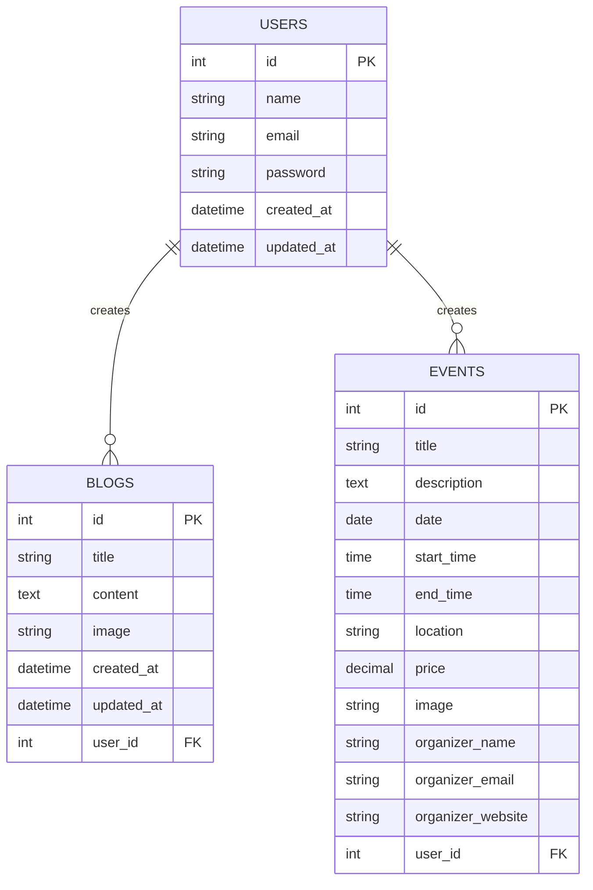

# README

```mermaid
erDiagram
    BLOGS {
        int id PK
        string title
        text content
        string image
        datetime created_at
        datetime updated_at
        int user_id FK
    }
    EVENTS {
        int id PK
        string title
        text description
        date date
        time start_time
        time end_time
        string location
        decimal price
        string image
        string organizer_name
        string organizer_email
        string organizer_website
        int user_id FK
    }
    USERS {
        int id PK
        string name
        string email
        string password
        datetime created_at
        datetime updated_at
    }
    USERS ||--o{ BLOGS : "creates"
    USERS ||--o{ EVENTS : "creates"
```
